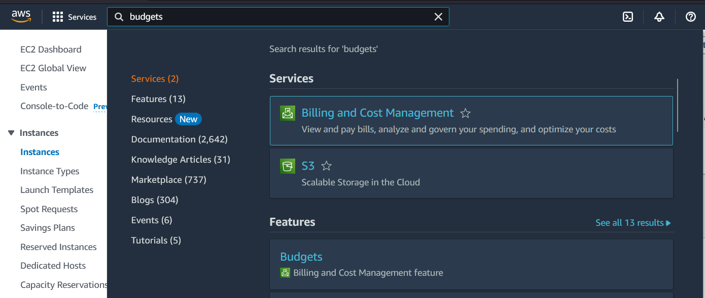
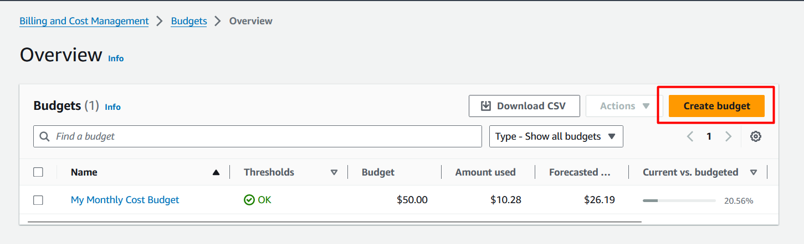
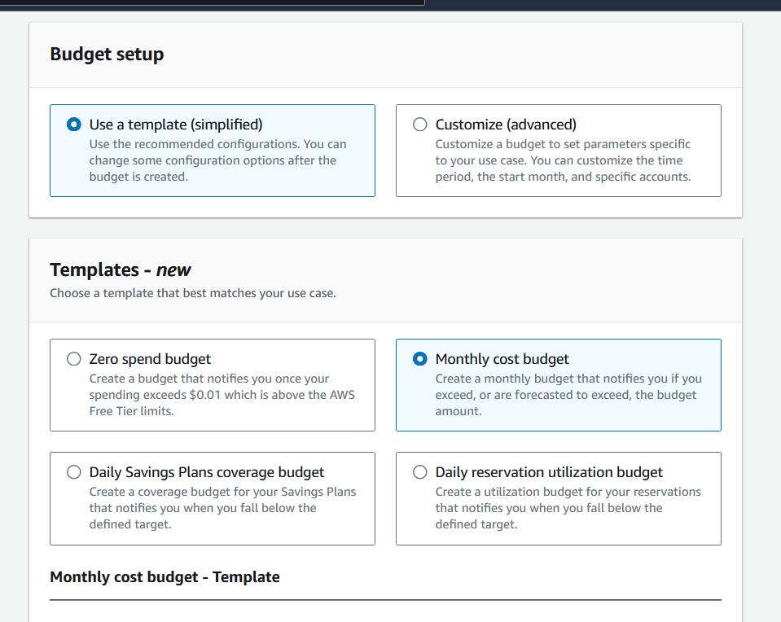
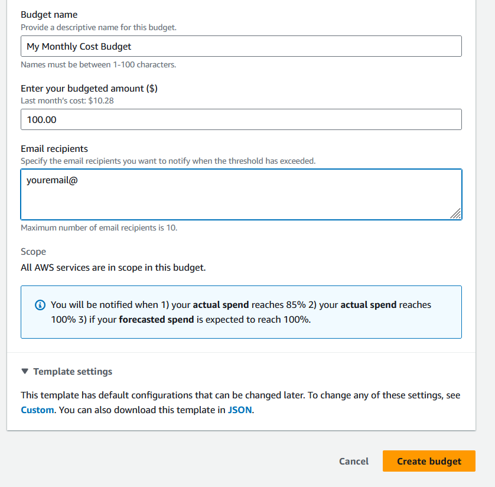

# Lab-Setting-up-AWS-Budgets

- Go to AWS Console and type "budgets' and click 

- Click  `Create budget` 

- Under Choose budget type, select `Use a template (simplified)` and `Monthly cost budget`

- `Budget name`: My Monthly Cost Budget

- `Enter your budgeted amount ($)`: 100

- `Email recipients`: your email

- Click `Create Budget`

-----
***Congratulations, you have created a Budget to send a notification.***
-----